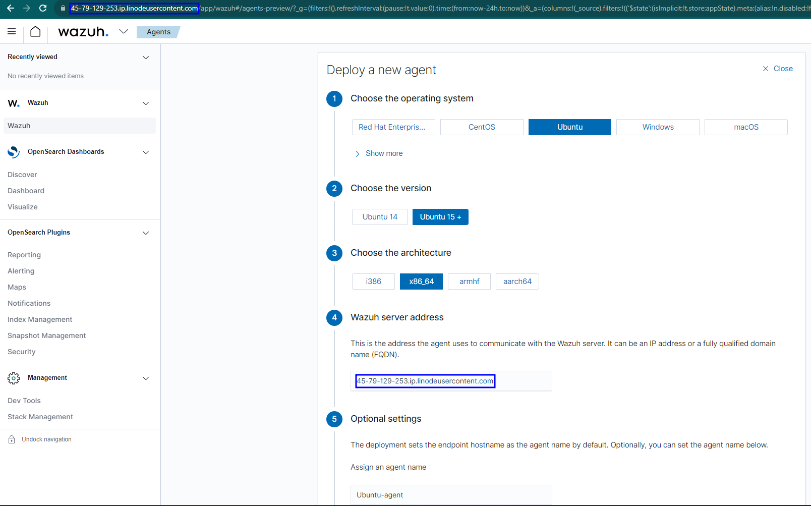
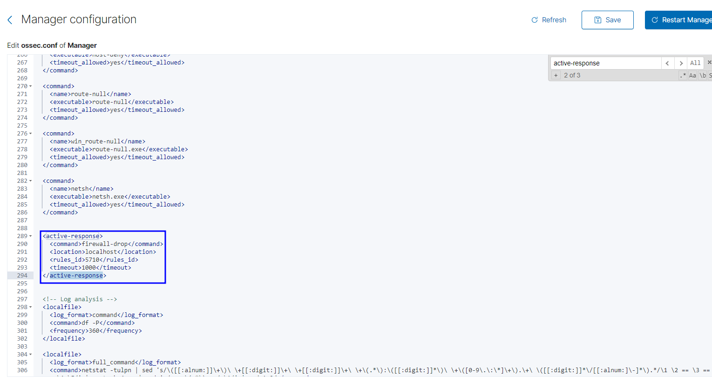
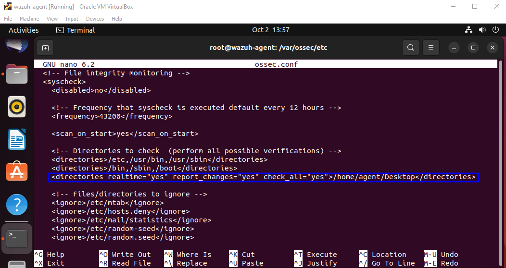
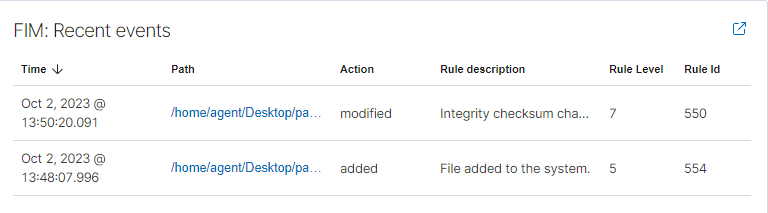
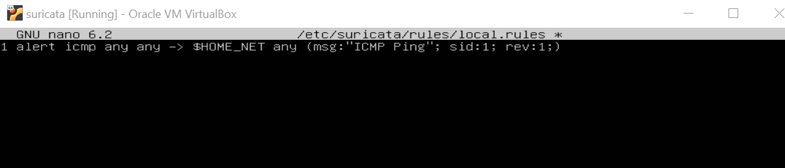
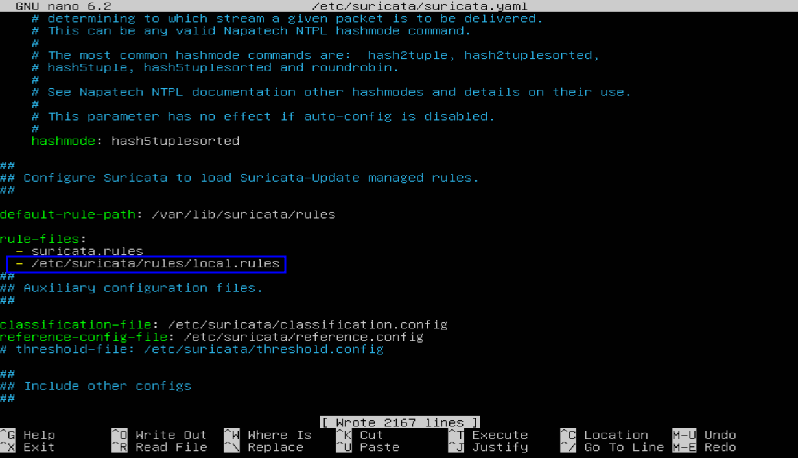
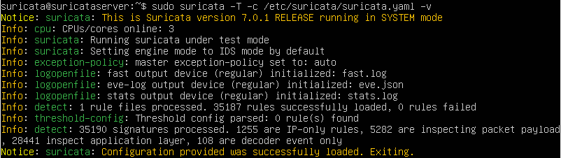
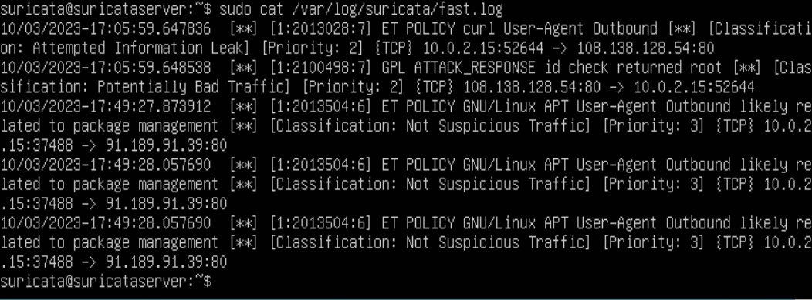
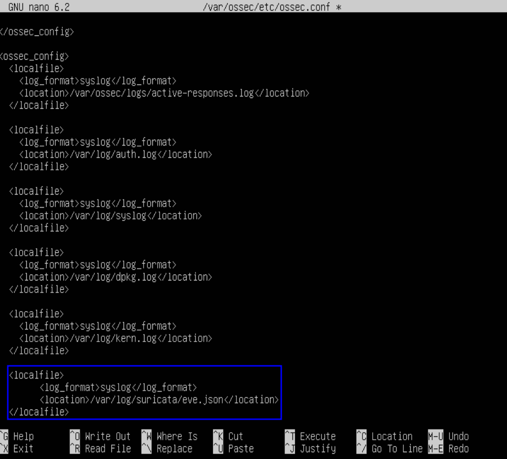
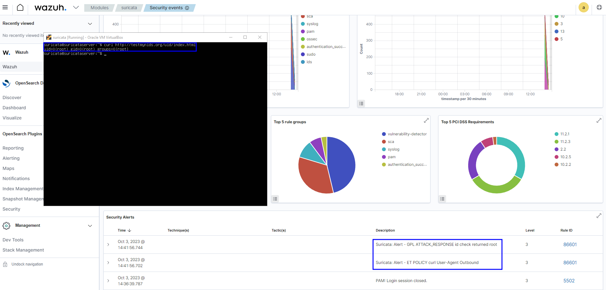

<h1>Wazuh SIEM with Suricata IDS</h1>

<h2>Description</h2>
Welcome to the Wazuh SIEM Environment project! This repository provides comprehensive documentation and resources to help you set up a open source SIEM(Security Information and Event Manager). A SIEM is a key tool for blue teamers, it allows for a centralized dashboard for collecting, analyzing, aggerating, and indexing security related data. Aiding in detecting intrustions, attacks, and vulnerabilities.

 

<h2>What You'll Find in This Repository</h2>
Installation Guide: Step-by-step instructions to configure a Wazuh SIEM on your system, including system requirements and configuration details. In this guide I will be using Linode to host my Wazuh server. Other options are using AWS or a OVA file linked below:
The Wazuh Documentation is below: 

[OVA File](https://documentation.wazuh.com/current/development/packaging/generate-ova.html)
 

<h2>Wazuh Walk Through</h2>

1. In the Linode market place select the "Wazuh" App. Enter your email for the SSL cert. Create a Sudo user that can SSH into the Wazuh cloud. Upon deployment wait 5 minutes for Wazuh to configure.
2. SSH into Wazuh
   When your machine is running open up a terminal and ssh into the machine.  
   -  ssh root@xxx.xxx.xxx.xxx
3. Once you log into the Wazuh box you can run the following command to check for .deploymet-secerts.txt
   "ls -al"
4. We need to view insde the text file so run the following command:
   "cat .deployment-secert.txt" 
5. Find and copy the indexer_password for the web user interface
6. Now we need to open the Wazuh dashboard. On linode find the Reverse DNS address for your user interface. Copy that into a web browser. Use username "admin" and the password found on step 5 to login.
7. Now we need to add agents for our SIEM to monitor. On the wazuh dashboard navigate to Agents then Deploy new agent.
8. To deploying an agent choose the proper Operating System, Version, Architecture, FQDN (this will be the address on your dashboard), name your agent, and give it a group to operate in.
    
    
    
10. Changing managment configuration to turn on the Vulnerabilty detector. On the Wazuh Dashboard go to management the configuration and select edit configuration. Ensure the detecter is enabled, and enable the operating system types you will be using.
11. Adding Active response to our SIEM. In the Managment configuration we need to create a rule to protect against brute force. 
    <active-response> 
         "<command>firewall-drop</command> 
         <location>localhost</location> 
         <rules_id>5710</rules_id> 
         <timeout>1000</timeout> 
    <active-response> "

13. Deploying File integrity monitor. This is optional in your agents but if you want intergiry on your files you can add a FIM inside the agents. Located inside ossec.conf file you add the following settings:    <directories realtime="yes" report_changes="yes" check_all="yes">FILEPATH/OF/MONITORED/DIRECTORY</directories>
 
- [Wazuh FIM Documentation](https://documentation.wazuh.com/4.5/user-manual/capabilities/file-integrity/how-to-configure-fim.html)
 
 
 
This is what the SIEM will display when a file has been changed inside the directory the FIM is deployed in.
 

By following the previous steps the should be SIEM deployed with agents having file integrity monitors and protection agaisint brute force. Now we are going to deploy our suricata IDS that send network logs to our SIEM.

<h2>Suricata Deployment:</h2>

1.) Deploy a Ubuntu 22.04.1 server with a minimum of 2 CPU and 4 RAM.

2.) To set up suricata install we need to run a few commands inside the ubuntu vm: 
      - sudo apt-get install software-properties-common 
      - sudo add-apt-repository ppa:oisf/suricata-stable 
      - sudo apt-get update 

3.) Now install suricata with the following commmand:
      sudo apt-get install suricata

4.) With Suricata  installed on your machine, update and upgrade with the following commands:
      sudo apt-get update
      sudo apt-get upgrade suricata

5.) Check the status of suricata:
      sudo systemctl status suricata
    If needed turn suricata off so we can begin configuring: 
      sudo systemctl stop suricata

6.) Gather network information by running:
      ip addr
   Write down interface name and IP subnet

7.) We need to edit the suricata YAML file to edit the configuration
      sudo nano /etc/suricata/suricata.yaml

8.) Inside the file we need to change a few things. The first is your IP Range, set your IP range that you want to be monitored. 
Next you have to change your interface name for AF-packet interface. Finaly add community_ID field to EVE records      

9.) Next we are going to want to update our rule sources, run the command:
      sudo suricata-update update-sources

10.) Now a rules directory with the following command:
      sudo mkdir /etc/suricata/rules

11.) Now that we have a rules directory we can make a rules file that we can call from. Use the following command:
      sudo nano /etc/suricata/rules/local.rules
This will add a file name local.rules and inside of the file add the following rule:
      alert icmp any any -> $HOME_NET any (msg:"ICMP Ping"; sid:1; rev:1;)

       

This Suricata rule is set to trigger an alert for ICMP (Internet Control Message Protocol) ping traffic. When an ICMP packet is detected from any source IP and any source port to any IP within the defined home network, an alert message labeled "ICMP Ping" will be generated. 

12.) Now go back into the yaml file too add this rule set. Use the following command to enter the yaml file:
      sudo nano /etc/suricata/suricata.yaml

13.) Once insde the yaml file we need to add the location of the newly created rule file to the rule path. Hit ctl w to search for "rule-files" and add the file location:
      - /etc/suricata/rules/local.rules

14.) When you add the rule path to the local.rule file you can check for configuration success with the following command:
      sudo suricata -T -c /etc/suricata/suricata.yaml -v

15.) Now that our rules are added can we can test the IDS with two differnt tests:
      1.) running the command:
            curl http://testmynids.org/uid/index.html
         Which performs an HTTP GET request to a nids tester. We can see the IDS do its magic by running the following command:
            sudo cat /var/log/suricata/fast.log
      
      2.) Pinging our machine to test our ICMP Alert rule. 
            ping xxx.xxx.xxx.xxx
         We can see the results by running 
            sudo cat /var/log/suricata/fast.log
     In the following image inside the fast log you can see the ICMP traffic and the GET request:
    

<h2>Integrating Suricata Logs with Wazuh</h2>

Now that we have our IDS deployed and configured we need to connected it to our SIEM. On the Wazuh add agent screen get the add agent command and use it on the suricata machine and start the Wazuh service.
We then have to edit the ossec.conf file on both the suricata machine and the Wazuh manager configuration file. 
At the bottom of both files we need to add the following:
   #<localfile>
      #<log_format>syslog</log_format>
      #<location>/var/log/suricata/eve.json</location>
   #</localfile>
# 
 

In the following image you can observe logs that the IDS has collected and the SIEM will display????
 

<h2>Languages and Utilities Used</h2>

- <b>PowerShell</b> 
- <b>Orcale Virtual Box</b>
- <b>Python</b>
- <b>sysmon</b>

